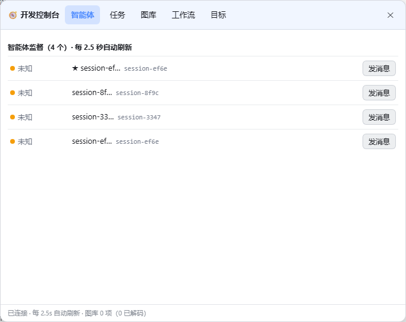
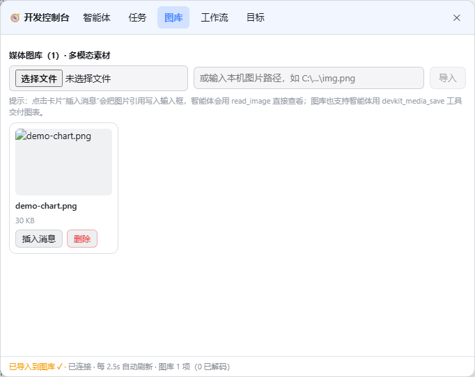
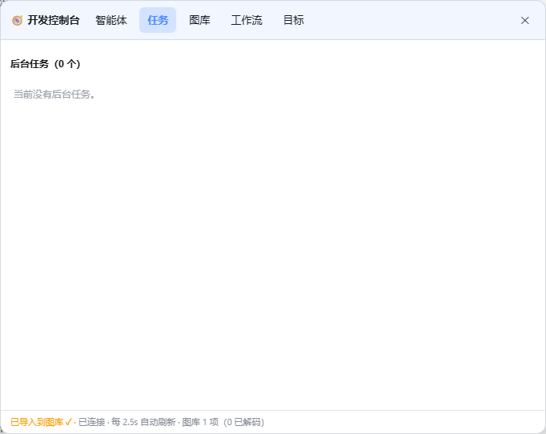
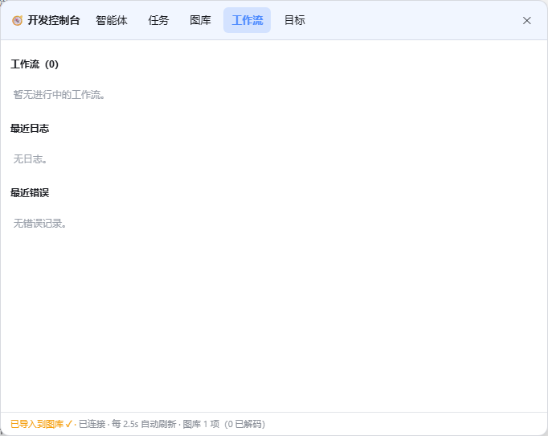
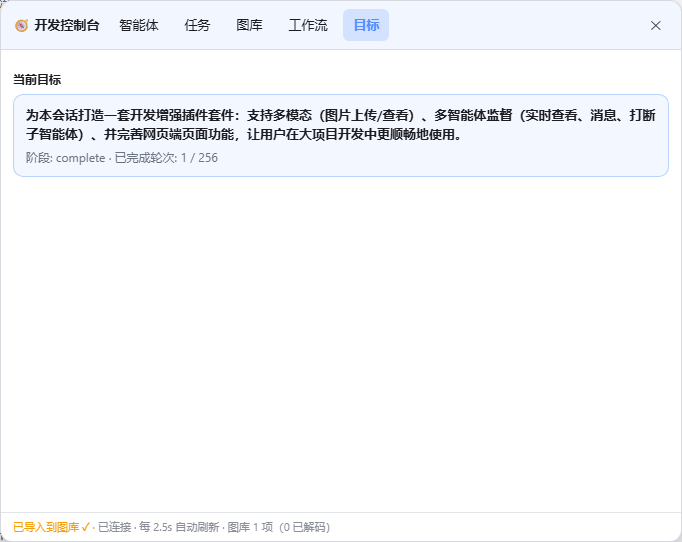

# DSH 开发增强套件 (DevKit)

> DeepSeek Harness 动态 Cordis 插件：**多模态图库 + 多智能体监督控制台**，为大项目开发而生。


本插件以「动态 Cordis 插件包」（Host 半 + Client 半）的形式运行在 DeepSeek Harness（DSH）中：宿主半运行在 Node.js 进程内，负责状态聚合、子智能体操作、媒体存取与模型工具注册；浏览器半以 React 组件注入 DSH 网页端的官方插槽，提供完整的中文控制台界面。

## 📸 界面预览

| 智能体监督 | 多模态图库 | 后台任务 |
|---|---|---|
|  |  |  |

| 工作流监督 | 目标总览 |
|---|---|
|  |  |

## ✨ 功能特性

### 🧭 智能体监督（会话标题栏「🧭」按钮 → 大监督面板）
- **实时总览**：主会话与所有子智能体（★ 标记当前会话），状态点区分 🟢运行中 / 🔵空闲 / ⚪就绪 / 已结束，每 2.5 秒自动刷新
- **发消息**：向任意子智能体追加任务（作为它的下一轮，可唤醒休眠的子智能体）
- **打断**：一键停止子智能体当前轮次（已排队消息保留）
- **任务看板**：后台任务按「进行中 / 等待 / 已结束」三列看板分组，一键请求结束
- **工作流**：工作流运行状态、当前阶段、最近日志、最近错误
- **目标**：当前会话目标（objective / 阶段 / 轮次 / 阻塞原因）总览

### ⚡ 实时令牌统计（输入框正下方，与官方统计条并排）
- 实时显示本次生成的 输出 token / 耗时 / TPS / 输入 token，生成中跳字
- 无数据时显示灰色占位「待首次生成」；监督面板内显示会话进程累计用量（启发式估测）

### 🖼 多模态图库（输入框工具行「🖼」按钮 → 大图库弹层）
- **两种上传方式**：浏览器选择文件上传 / 输入本机绝对路径导入
- **自动校验**：仅接受 PNG / JPEG / GIF / WebP，限制 8MB
- **自动解码**：把 base64 落为真实图片文件，供模型 `read_image` 直接查看
- **插入消息**：一键把图片引用直接写入聊天输入框（发消息即可让智能体看图）
- 模型侧可用 `devkit_media_save` 把生成的图表/截图直接交付到图库
- **外部视觉模型识图**：任意 OpenAI 兼容服务商（智谱/OpenAI/Kimi/MiniMax/硅基流动等）可添加/删除 API Key 路由，图库每张图片一键识图

### ⚙️ 设置页「开发增强套件」（设置 → 开发增强套件）
- **视觉模型管理**：添加/删除任意 OpenAI 兼容视觉路由（与图库弹层内的管理入口共用）
- **6 款皮肤**：亮色 / 暗夜 / 海洋 / 森林 / 日落 / 水墨，即点即换、本地持久化
- 关于与致谢

### 🔧 页面增强
- 输入框上方**精简状态条**：智能体 / 运行 / 任务 / 图库 计数 + 图库/监督快捷按钮
- 所有功能都是页面原生按钮与原生位置，无浮窗小面板

### 🤖 模型侧监督工具（4 个）
| 工具 | 用途 |
|---|---|
| `devkit_agents` | 查看智能体/任务/目标/工作流快照 |
| `devkit_send_agent_message` | 向子智能体发消息 |
| `devkit_interrupt_agent` | 打断子智能体当前轮次 |
| `devkit_media_save` | 保存图片到用户图库 |

---

## 📦 文件结构

```
dsh-devkit/
├── README.md                本文件
├── LICENSE                  MIT 许可证
├── docs/
│   ├── preset-install.md    常驻安装教程（固化为智能体预设）
│   └── screenshots/         界面截图
├── src/
│   ├── host.js              Host 半（Node）：状态聚合、RPC、动态工具
│   └── client.js            Client 半（浏览器）：React 控制台 UI
├── tools/
│   └── screenshot.mjs       无头浏览器截图工具（CDP 驱动）
└── .github/                 Issue/PR 模板与 CI（语法校验）
```

---

## 🚀 安装方式

### 方式一：GUI 动态加载（最快，会话级）
1. 在 DSH 网页端对话中，让智能体执行 `cordis_define`：
   - `code.host` 粘贴 `src/host.js` 的内容
   - `code.client` 粘贴 `src/client.js` 的内容
2. 执行 `cordis_run` 并在运行卡片上批准（勾选双勾可授权未来版本）。
3. 页面立即出现 🧭 控制台。

### 方式二：固化为常驻预设（重启不丢失）
详见 [docs/preset-install.md](docs/preset-install.md)：把插件发布为 npm 包后，作为插件行写入你自有预设的 `agent.cordis.yml`。

### 依赖说明
- 运行于 DSH（Node.js + Web GUI），使用其官方服务与插槽：`agents`、`subagents`、`jobs`、`fs`、`goals`、`shell`、`sandboxPolicy`（宿主侧）与 `slots`、`timer`（浏览器侧）
- 图片「自动解码为真实文件」依赖本机 `pwsh`；缺失时自动降级为 base64 文本存储（不影响图库预览）

---

## 🔌 包内 RPC 接口（Client → Host）

| 方法 | 参数 | 说明 |
|---|---|---|
| `state` | `{}` | 全部监督数据快照（智能体/任务/目标/工作流/日志/错误/媒体） |
| `media-save` | `{name, base64}` | 保存图片（自动校验+解码） |
| `media-import` | `{path}` | 从本机路径导入图片 |
| `media-read` | `{ref}` | 读取图片 base64（供缩略图） |
| `media-delete` | `{ref}` | 从图库删除 |
| `agent-message` | `{agentId, text}` | 向子智能体发消息 |
| `agent-interrupt` | `{agentId}` | 打断子智能体 |
| `job-kill` | `{jobId}` | 结束后台任务 |

---

## 🛠 开发

- 语法校验：`node -e "new Function(require('fs').readFileSync('src/host.js','utf8'))"`（client 同理）
- 截图工具：`tools/screenshot.mjs` 通过 CDP 驱动无头 Edge 截取真实控制台面板（README 中的截图即出自它）

## ⚠️ 已知限制

- 动态插件为**进程级生命周期**：DSH 重启后需重新激活（方式二可解决）
- 图库数据保存在工作区（`.dsh-media/` 子目录；旧版本遗留文件为 `.dsh-media-*.txt`）
- 「路径导入」读取本机文件，依赖 DSH 的文件沙箱策略
- 「Git 变更」页签依赖 shell 服务执行 `git`：插件执行前自动清理宿主进程注入的不完整 `GIT_CONFIG_*` 环境变量；若 git 仍不可用（PATH 缺失/沙箱限制），自动降级为「分支名来自 `.git/HEAD` + 变更列表提示原因」，其余功能不受影响

## 🕰 更新日志

### v4.0（原生嵌入版 — 重构交互）
- **移除浮窗式控制台**：不再需要点击小按钮打开小面板
- **图库按钮**嵌入输入框工具行（`conversation.input.left`）：点击打开挂在输入框上的**大图库弹层**（上传/路径导入/识图/插入消息/删除/视觉模型管理），插入消息直接写入输入框
- **监督按钮**嵌入会话标题栏（`conversation.session.header.actions`）：智能体树（发消息/打断）+ 任务看板 + 工作流 + 目标总览
- **实时令牌统计**移到输入框正下方官方统计条位置（`conversation.composer.dock`），与系统自带 stats 并排
- **设置中心新页「开发增强套件」**（`settings.section`）：视觉模型管理 + 6 款皮肤切换 + 关于
- 保留输入框上方精简状态条（计数 + 图库/监督快捷按钮）

### v3.2（令牌统计可见性）
- 无数据时显示灰色占位「待首次生成」；控制台底栏显示用量摘要

### v3.0（借鉴社区优化版）
- 新增**实时令牌统计**：Host 半包裹 `llm/stream` 瀑布事件 + `tokenMeter` 启发式估价，状态条实时显示输出 token / 耗时 / TPS / 输入 token，控制台显示累计用量
- 新增 **Git 变更（SCM）** 页签：`git status` 变更面板，单文件暂存 / 取消暂存 / 丢弃 + 全部暂存
- 新增**文件浏览与预览**页签：工作区目录树 + 图片/文本即时预览
- 后台任务改为**看板**三列布局（进行中 / 等待 / 已结束）
- 新增**皮肤中心**：亮色 / 暗夜 / 海洋 / 森林 / 日落 / 水墨 6 款皮肤，即点即换并持久化
- 控制台面板支持左缘**拖拽调宽**（380–1180px，宽度记忆）
- 功能设计借鉴社区项目 [dsh-web-ui](https://github.com/zhu1090093659/dsh-web-ui)（Apache-2.0）的任务看板 / 实时令牌统计 / SCM 变更 / 文件预览 / 皮肤中心思路，实现为精简自有版本，特此致谢

### v2.6（视觉管线全链路验证）
- 修复 v1 起存在的图片字节损坏（沙箱 btoa 按 UTF-8 编码导致高位字节重编码）：改用手写 base64 编码器
- 修复图片自动解码：shell 服务本身是 PowerShell 宿主，改为直接执行 PowerShell 语句
- 修复识图附件保存：优先读取已解码真实文件获得宿主领域字节
- 新增多视觉模型管理：任意 OpenAI 兼容服务商（智谱/OpenAI/Kimi/MiniMax/硅基流动等）可随时添加/删除 API Key 路由
- 图库每张图片一键「识图」，调用所选视觉模型返回描述并可插入消息；新增 devkit_vision_describe 模型工具
- 已用智谱 GLM-4.5V 实测通过（几何图形 + 文字识别）

### v2.0
- 修复「插入消息」失效：改用真实 `InputActions.setDraft` API，自动追加到当前草稿末尾；自动插入失败时提供可复制文本框兜底
- 智能体显示真实会话标题；主会话固定显示「★ 主会话」；深层子智能体按 `parentId` 正确投递消息
- 禁止给主会话自己发消息 / 打断主会话
- 媒体文件归入 `.dsh-media/` 子目录（兼容读取旧版文件）
- 控制台新增「刷新」「复位位置」按钮；状态条新增刷新按钮；拖拽偏移修正

### v1.3（初始发布）
- 多模态图库、多智能体监督控制台、8 个包内 RPC、4 个模型工具

## 📄 许可证

[MIT](./LICENSE) © 2026 deepseek-Hsrness 社区
